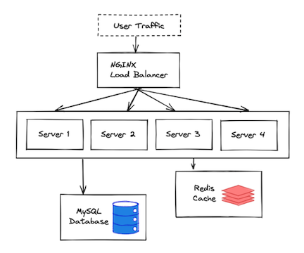
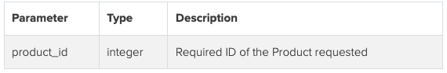
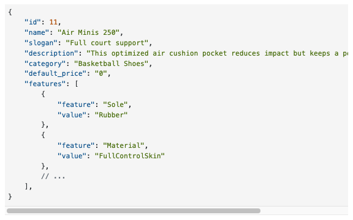
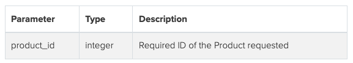
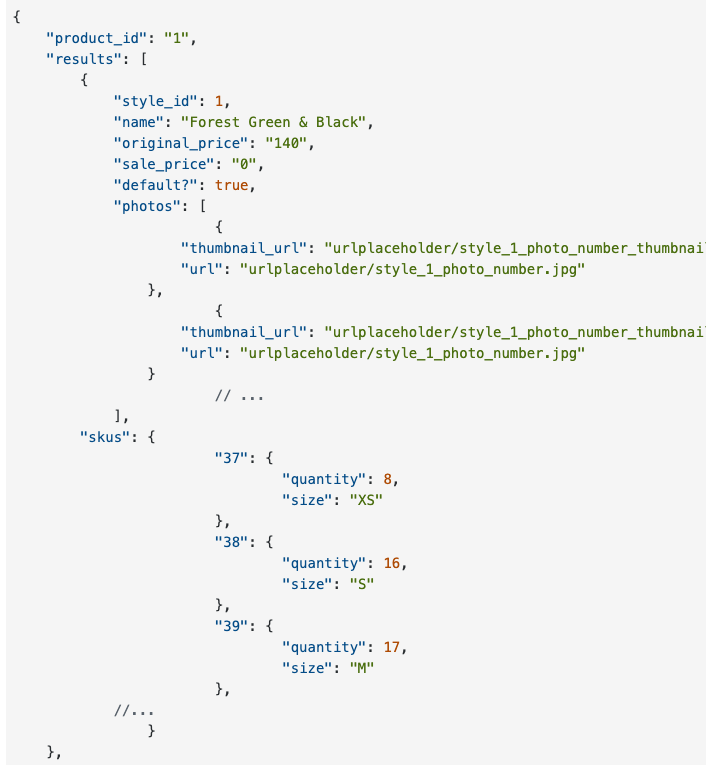
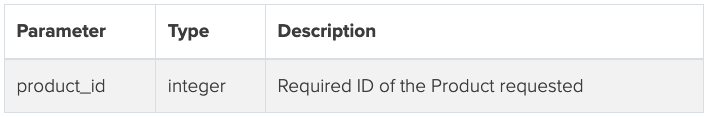
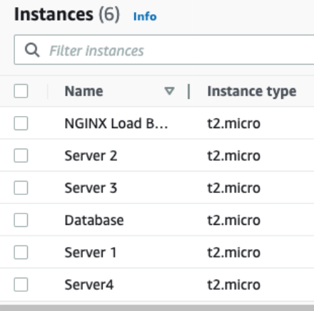

<h1 align="center" style="font-size: 2.7rem;">Atelier</h1>

<h2 align="center" style="font-size: 1.5rem;">An e-commerce RESTful API microservice. The API contains data on roughly 1 million apparel and fashion products  

## Table of Contents

- [Overview](#Overview)
- [Technologies Used](#Technologies-Used)
- [Database and ETL](#Database-and-ETL)
- [Server Routes](#Server-Routes)
- [Deployment](#Deployment)
- [Optimization 1: NGINX and Horizontal Scaling](#Optimization-1:-NGINX-and-Horizontal-Scaling)
- [Optimization 2: Redis Caching](#Optimization-2:-Redis-Caching)
- [System Design](#System-Design)
- [Performance Testing](#Performance-Testing)
- [Contributors](#Contributors)

## Overview
- This is an e-commerce Restful API microservice, containing data on roughly 1 million apparel and fashion products
- Performed an extract, transform, and load (ETL) process to transfer 12+ million records from 6 CSV files into a deployed **MySQL** database
- Designed **RESTful API** server to handle front end requests
- Implemented server side caching with **Redis** to improve latency
- Scaled horizontally using an **NGINX** load balancer
- Deployed at low cost using **AWS** EC2 T2micros
- Tested response times and user throughput using **Loader.io**

  

## Technologies Used
- [React](https://reactjs.org/)
- [Node.js](https://nodejs.org/en/)
- [Express](https://expressjs.com/)
- [MySQL](https://www.mysql.com/)
- [AWS](https://aws.amazon.com/)
- [NGINX](https://www.nginx.com/)
- [Redis](https://redis.io/)
- [Loader](https://loader.io/)

## Database and ETL
ETL
- Data for the API originally came in the form of 6 csv files: product, features, styles, photos, skus,and related products
- Created a local MySQL database with a schema identical to the CSV files, then used 'LOAD DATA' statements to transfer the data from the CSVs into the database (see ETL.sql and schema.sql files)
- Matching the database schema with the CSV file structures meant that no compute intensive data transformations were required (I skipped the 'T' in 'ETL')
- Attempted using NodeJS's fs.createWriteStream() and fs.createReadStream(), which would have allowed for transforming the data, but it was too compute intensive (waited 10 hours to finish a single CSV file, then computer froze)

Database Queries
- Some server endpoints required data from 3 different database tables. I used table joins to reduce the number of queries required, then further shaped the data in the server

## Server Routes:

1. `GET /products` - Retrieves a list of products

    Parameters

    

    Response

    `Status: 200 OK`

    

2.  `GET /products/:product_id` - Returns all product level information for a specified product id

    Parameters

    

    Response

    `Status: 200 OK`

    
3. `GET /products/:product_id/styles` - Returns all styles available for a given product

    Parameters

    

    Response

    `Status: 200 OK`

    

4. `GET /products/:product_id/related` - Returns the IDs of products related to the product specified

    Parameters

    

    Response

    `Status: 200 OK`

    

## Deployment
- Deployed server and database on AWS using EC2 t2.micros
- Used Secure Copy Protocol (SCP) to transfer data from local database into deployed database
- Altered deployed database to connect to deployed server. I permisisoned the specific IP address of server, to make more secure

## Optimization 1: NGINX and Horizontal Scaling
- After deployment, improved performance using horizontal scaling
- Used NGINX as a load balancer
  - Install NGINX on a new EC2 instance
  - Edit the nginx.conf file to specify the ip addresses and ports of each server that traffic will be routed to
  - Edit the http specification to have an ‘upstream’ section
  - Specify the method of request distribution (I tried least connections and round robin)
  - Under server location, proxy pass the upstream section
  - Any request coming to NGINX EC2 on the specified port is now routed to one of the upstream servers
    - Tested by putting a console.log on one endpoint for every upstream server, then requesting data from that endpoint multiple times
    - If a different server console.log is triggered by each request, then we know the requests are being distributed to a different server each time

## Optimization 2: Redis Caching
- Further improved performance by caching responses for the most compute intensive server endpoint (in this case an endpoint that made multiple database queries)
- Chose Redis for caching, due to ease of implementation (see server index.js file)
  - Each time a request is made, the server first checks the Redis cache for the data. The server then only queries the MySQL database if the information isn't already found in the Redis cache
ƒ
## System Design
Here is what the final system design looked like, after impleminting horizontal scaling and Redis caching

## Performance Testing:
- I tested throughput and server response times of the deployed server, both before and after performance optimizations
- After implementing horizontal scaling and caching, server throughput improved from 700rps to 2000rps, while maintaining a 15ms response time and an error rate <1%

  

## Contributors:

<table>
  <tr>
    <td align="center"><a href="https://github.com/TN423"> <b>Justin Hurst</b></a> </td>
  </tr>
</table>

<!-- https://learn-2.galvanize.com/cohorts/2779/blocks/94/content_files/Front%20End%20Capstone/project-atelier-catwalk/products.md -->