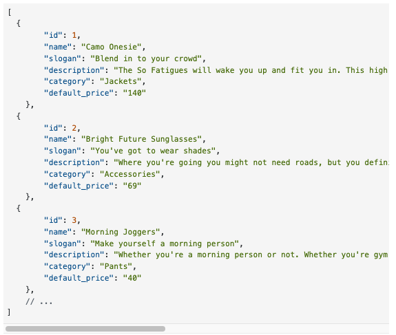
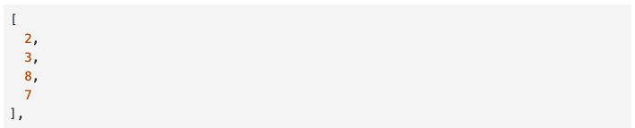

<h1 align="center" style="font-size: 2.7rem;">Atelier</h1>

<h2 align="center" style="font-size: 1.5rem;">An e-commerce RESTful API microservice. The API contains data on roughly 1 million apparel and fashion products  

## Table of Contents

- [Overview](#Overview)
- [Technologies Used](#Technologies-Used)
- [Database and ETL](#Database-and-ETL)
- [Server Routes](#Server-Routes)
- [Deployment](#Deployment)
- [Performance Testing](#Performance-Testing)
- [Optimization 1: NGINX and Horizontal Scaling](#Optimization-1)
- [Optimization 2: Redis Caching](#Optimization-2)
- [Contributors](#Contributors)

## Overview
2022 Update - This project was originally deployed on AWS, but has since been spun down
- This is an e-commerce Restful API microservice, containing data on roughly 1 million apparel and fashion products
- Performed an extract, transform, and load (ETL) process to transfer 12+ million records from 6 CSV files into a deployed **MySQL** database
- Designed **RESTful API** server to handle front end requests
- Implemented server side caching with **Redis** to improve latency
- Scaled horizontally using an **NGINX** load balancer
- Deployed at low cost using **AWS** EC2 T2micros
- Tested response times and user throughput using **Loader.io**

## Technologies Used
- [React](https://reactjs.org/)
- [Node.js](https://nodejs.org/en/)
- [Express](https://expressjs.com/)
- [MySQL](https://www.mysql.com/)
- [AWS](https://aws.amazon.com/)
- [NGINX](https://www.nginx.com/)
- [Redis](https://redis.io/)
- [Loader](https://loader.io/)

## Database and ETL
ETL
- Data for the API originally came in the form of 6 csv files: product, features, styles, photos, skus,and related products
- I created a local mySql database with a schema identical to the CSV files, then used 'LOAD DATA' statements to transfer the data from the CSVs into the database (see ETL.sql and schema.sql files)
- Matching the database schema with the CSV file structures meant that I didn't need to do any compute intensive data transformations (I skipped the 'T' in 'ETL')
- I also attempted using NodeJS's fs.createWriteStream() and fs.createReadStream(), which would have allowed for transforming the data, but it was too compute intensive (waited 10 hours to finish a single CSV file, then computer froze)

Database Queries
- Some server endpoints required data from 3 different database tables. I used table joins to reduce the number of queries required, then further shaped the data in the server

## Server Routes:

1. `GET /products` - Retrieves a list of products

    Parameters

    

    Response

    `Status: 200 OK`

    

2.  `GET /products/:product_id` - Returns all product level information for a specified product id

    Parameters

    

    Response

    `Status: 200 OK`

    
3. `GET /products/:product_id/styles` - Returns all styles available for a given product

    Parameters

    

    Response

    `Status: 200 OK`

    

4. `GET /products/:product_id/related` - Returns the IDs of products related to the product specified

    Parameters

    

    Response

    `Status: 200 OK`

    

- https://learn-2.galvanize.com/cohorts/2779/blocks/94/content_files/Front%20End%20Capstone/project-atelier-catwalk/products.md

## Deployment

- xx

## Deployment - Server:

- xx

## Performance Testing:

## Optimization 1: NGINX and Horizontal Scaling:
- xx

## Optimization 2: Redis Caching:
- xx

## Contributors:

<table>
  <tr>
    <td align="center"><a href="https://github.com/TN423"> <b>Justin Hurst</b></a> </td>
  </tr>
</table>
